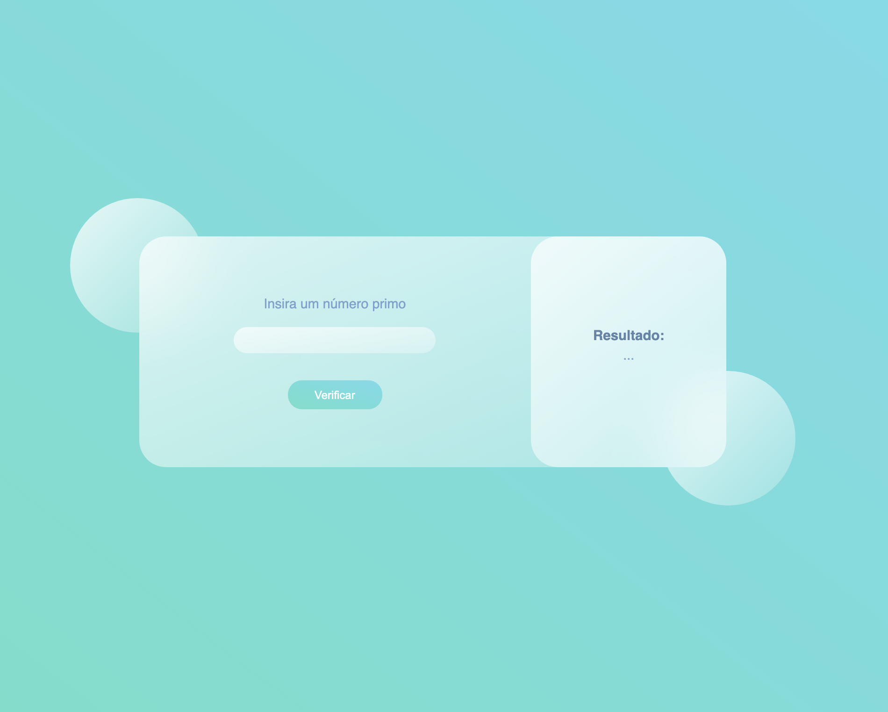

<p align="center">
  <a href="#-technologies">Technologies</a>&nbsp;&nbsp;&nbsp;|&nbsp;&nbsp;&nbsp;
  <a href="#-layout">Getting started</a>&nbsp;&nbsp;&nbsp;|&nbsp;&nbsp;&nbsp;
  <a href="#-project">Project</a>&nbsp;&nbsp;&nbsp;|&nbsp;&nbsp;&nbsp;
  <a href="#-license">License</a>
</p>

<p align="center">
  
  
  

  
</p>

<br>

<p align="center">
  
</p>

## 👨🏻‍💻 Status

Finished

## 🧪 Technologies

This project was developed using the following technologies:

- [React](https://reactjs.org)

## 🚀 Getting started

Clone the project and access the folder

```bash
$ git clone https://github.com/JorgeFPeres/multivision-tests.git && cd multivision-tests
```

Follow the steps below

```bash
# Install the dependencies
$ npm install

# Start the project
$ npm start
```

## 💻 Project

This is a exercice to know if the number is prime.


## 📝 License

This project is licensed under the MIT License. See the [LICENSE](LICENSE.md) file for details.

---

<p align="center">Made with ❤️ by Jorge F Peres</p>
